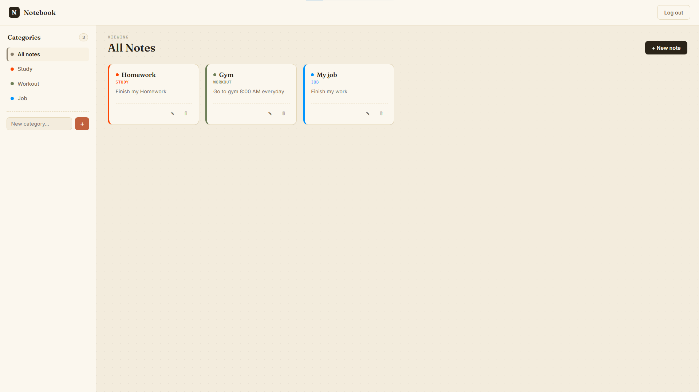
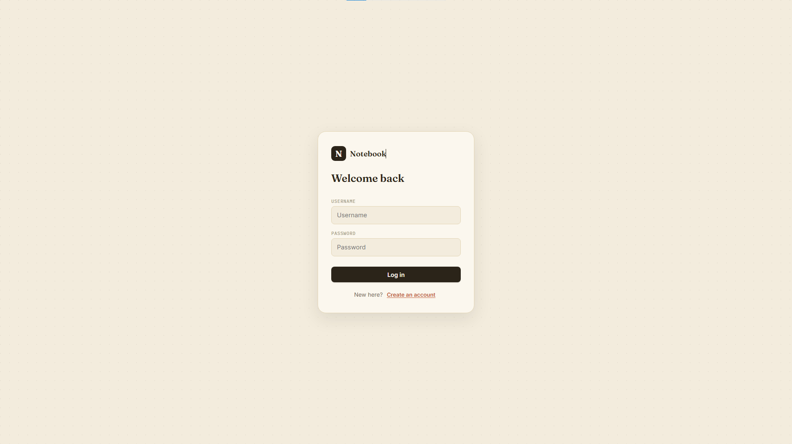

# Notebook — Full-Stack Notes App

A per-user notes application with authentication, categorized organization, and full CRUD — built end-to-end in TypeScript, from a vanilla JavaScript/SQLite prototype through a full TypeScript rewrite and a PostgreSQL migration.

**🔗 Live app:** https://monocode-notebook.vercel.app/






## Overview

This project started as a JavaScript/Express/SQLite app and was deliberately rebuilt in two stages to demonstrate real production-grade engineering practices:

1. **Full TypeScript conversion** — both the Express backend and the React frontend, including typed database rows, typed request bodies, a custom `express-session` type augmentation, and a generic `apiRequest<T>` utility for fully-typed API responses on the client.
2. **PostgreSQL migration** — moved off local SQLite onto a hosted PostgreSQL database (Neon), rewriting the entire query layer from `better-sqlite3`'s synchronous API to `pg`'s async/await-based one, plus a Postgres-backed session store.

## Tech stack

**Backend:** Node.js, Express, TypeScript, PostgreSQL (via `pg`), `express-session` + `connect-pg-simple`, bcrypt

**Frontend:** React, TypeScript, Vite

**Infrastructure:** Neon (PostgreSQL hosting), Render (API), Vercel (frontend)

## Features

- Signup / login / logout with per-user, session-based authentication (bcrypt-hashed passwords)
- Full notes CRUD, scoped to the logged-in user
- Categories: create, delete, and filter notes by category
- Responsive UI with a collapsible sidebar drawer on mobile

## API overview

| Method | Route                  | Description                     |
|--------|-------------------------|----------------------------------|
| POST   | `/signup`               | Create a new user account       |
| POST   | `/login`                | Authenticate and start a session|
| POST   | `/logout`                | End the current session         |
| GET    | `/api/categories`        | List the user's categories      |
| POST   | `/api/categories`        | Create a category               |
| DELETE | `/api/categories/:id`    | Delete a category               |
| GET    | `/api/notes`              | List notes (optional `?category=`) |
| POST   | `/api/notes`              | Create a note                   |
| PUT    | `/api/notes/:id`          | Update a note's title/content   |
| DELETE | `/api/notes/:id`          | Delete a note                   |

All `/api/*` routes require an authenticated session.

## Running locally

```bash
npm install
npm run install:all
```

Copy the example env file and fill in your own values:
```bash
cp server/.env.example server/.env
```

Then start both server and client together:
```bash
npm run dev
```
- Server: http://localhost:3000
- Client: http://localhost:5173

## Author

Built by [monocode-dev](https://github.com/monocode-dev)
